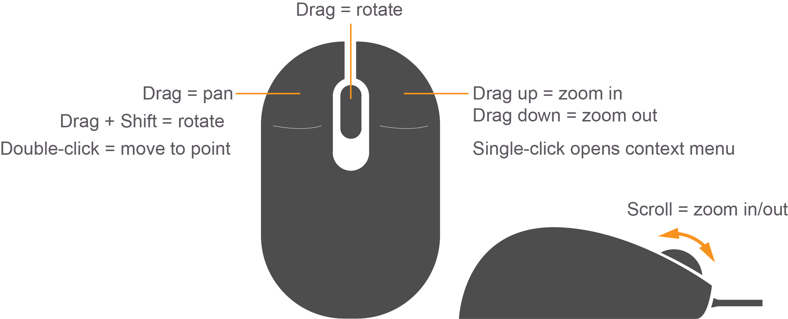
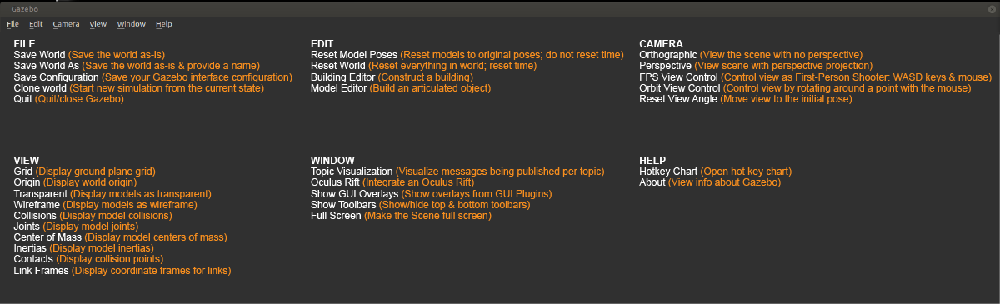

# Gazebo
Gazebo is a physics-based, high fidelity 3D simulator for robotics. Gazebo provides the ability to accurately simulate one or more robots in complex indoor and outdoor environments filled with static and dynamic objects, realistic lighting, and programmable interactions.

Gazebo facilitates robotic design, rapid prototyping, testing, and simulation of real-life scenarios. While Gazebo is platform agnostic and runs on Windows, Mac, and Linux, it is mostly used in conjunction with the Robotics Operating System (ROS) running on Linux systems. You will learn how to use ROS in the upcoming lessons. Simply put, Gazebo is an essential tool for every roboticist.

# Gazebo Features
Gazebo has eight features that you can take advantage of:

* Dynamics Simulation: Model a robot's dynamics with a high-performance physics engine.
* Advanced 3D Graphics: Render your environment with high-fidelity graphics, including lighting, shadows, and textures.
* Sensors: Add sensors to your robot, generate data, and simulate noise.
* Plugins: Write a plugin to interact with your world, robot, or sensor.
* Model Database: Download a robot or environment from Gazebo library or build your own through their engine.
Socket-Based Communication: Interact with Gazebo running on a remote server through socket-based(opens in a new tab) communication.
* Cloud Simulation: Run Gazebo on a server and interact with it through a browser.
* Command Line Tools: Control your simulated environment through the command line tools.


# Gazebo Workspace

We canlaunch Gazebo from the terminal by typing:
```bash
$ gazebo
```
Be advised that occasionally Gazebo gets stuck in a loading loop. If Gazebo does not fully load after about one minute, try closing it by pressing Ctrl+C while the Gazebo terminal is active. Then, try running the command again to restart Gazebo.


# Gazebo components
There are six components involved in running an instance of a Gazebo simulation:

Gazebo Server
Gazebo Client
World Files
Model Files
Environment Variables
Plugins

## 1- Gazebo Server
The first main component involved in running an instance of a Gazebo simulation is the Gazebo Server or also known by gzserver.

gzserver performs most of the heavy-lifting for Gazebo. It is responsible for parsing the description files related to the scene we are trying to simulate, as well as the objects within. It then simulates the complete scene using a physics and sensor engine.

While the server can be launched independently by using the following command in a terminal:
```bash
$ gzserver
```

It does not have any GUI component. Running gzserver in a so-called headless mode can come in handy in certain situations, but we will talk more about that in future lessons.


## 2- Gazebo Client
The second main component involved in running an instance of a Gazebo simulation is the Gazebo Client or also known by gzclient.

gzclient on the other hand provides the very essential Graphical Client that connects to the gzserver and renders the simulation scene along with useful interactive tools. While you can technically run gzclient by itself using the following command:
```bash
$ gzclient
```
it does nothing at all (except consume your compute resources), since it does not have a gzserver to connect to and receive instructions from.

### Combining Gazebo Server and Gazebo Client
It is a common practice to run gzserver first, followed by gzclient, allowing some time to initialize the simulation scene, objects within, and associated parameters before rendering it. To make our lives easier, there is a single intuitive command that necessarily launches both the components sequentially:
```bash
$ gazebo
```
## 3- World Files
A world file in Gazebo contains all the elements in the simulated environment. These elements are your robot model, its environment, lighting, sensors, and other objects. You have the ability to save your simulation to a world file that usually has a .world extension.

Gazebo can also read the content of a world file from your disk to generate the simulation. To launch the simulation from a world file, type:
```bash
$ gazebo <yourworld>.world
```

The world file is formatted using the Simulation Description Format or SDF(opens in a new tab) for short. Here’s the basic format of an SDF world file:

```html
<?xml version="1.0" ?>
<sdf version="1.5">
  <world name="default">
    <physics type="ode">
      ...
    </physics>
    
    <scene>
      ...
    </scene>

    <model name="box">
      ...
    </model>

    <model name="sphere">
      ...
    </model>

    <light name="spotlight">
      ...
    </light>

  </world>
</sdf>

```

## 4- Model Files
For simplification, you must create a separate SDF file of your robot with exactly the same format as your world file. This model file should only represent a single model (ex: a robot) and can be imported by your world file. The reason why you need to keep your model in a separate file is to use it in other projects. To include a model file of a robot or any other model inside your world file, you can add the following code to the world’s SDF file:
```html
<include>
  <uri>model://model_file_name</uri>
</include>
```

## 5- Environment Variables
There are many environment variables that Gazebo uses, primarily to locate files (world, model, …) and set up communications between gzserver and gzclient. While working on a robotic project, you’ll leave these variables as default. Here’s an example of a variable that Gazebo uses:

```bash
GAZEBO_MODEL_PATH: List of directories where Gazebo looks to populate a model file.
```

## 6- Plugins
To interact with a world, model, or sensor in Gazebo, you can write plugins. These plugins can be either loaded from the command line or added to your SDF world file. You’ll learn about World Plugins later in the lesson.


# Understanding the GUI

The Gazebo GUI is divided into four major sections:

1. Scene
2. Side Panel
3. Toolbars
4. Menu

## Scene

The scene is where you will be spending most of your time, whether creating a simulation or running one. While you can use a trackpad to navigate inside the scene, a mouse is highly recommended.

You can pan the scene by pressing the left mouse button and dragging. If you hold down SHIFT in addition, you can now rotate the view. You can zoom in and out by using the mouse scroll or pressing and dragging the RMB.



## Side Panel

The side panel on the left consists of three tabs:

1. World
2. Insert
3. Layers

### `World`

This tab displays the lights and models currently in the scene. By clicking on individual model, you can view or edit its basic parameters like position and orientation. In addition, you can also change the physics of the scene like gravity and magnetic field via the Physics option. The GUI option provides access to the default camera view angle and pose.

### `Insert`

This is where you will find objects (models) to add to the simulation scene. Left click to expand or collapse a list of models. To place an object in the scene, simply left-click the object of interest under the Insert tab; this will bind the object to your mouse cursor, and now you can place it anywhere in the scene by left-clicking at that location.

### `Layers`

This is an optional feature, so this tab will be empty in most cases. To learn more about Layers, click [here(opens in a new tab)](http://gazebosim.org/tutorials?tut=visual_layers&cat=build_robot).

## Top Toolbar

Next, we have a toolbar at the top. It provides quick access to some cursor types, geometric shapes, and views.

### `Select mode`

Select mode is the most commonly used cursor mode. It allows you to navigate the scene.

### `Translate mode`

One way to change an object's position is to select the object in the world tab on the side panel and then change its pose via properties. This is cumbersome and also unnatural, the translate mode cursor allows you to change the position of any model in the scene. Simply select the cursor mode and then use the proper axis to drag the object to its desired location.

### `Rotate mode`

Similar to translate mode, this cursor mode allows you to change the orientation of any given model.

### `Scale mode`

Scale mode allows you to change the scale, and hence, overall size of any model.

### `Undo/Redo`

Since we humans are best at making mistakes, the undo tool helps us revert our mistakes. On the other hand if you undid something that you did not intend to, the redo tool can come to the rescue.

### `Simple shapes`

You can insert basic 3D models like cubes, spheres, or cylinders into the scene.

### `Lights`

Add different light sources like a spotlight, point light, or directional light to the scene.

### `Copy/Paste`

These tools let you copy/paste models in the scene. On the other hand, you can simply press Ctrl+C to copy and Ctrl+V to paste any model.

### `Align`

This tool allows you to align one model with another along one of the three principal axes.

### `Change view`

The change view tool lets you view the scene from different perspectives like top view, side view, front view, bottom view.

## Bottom Toolbar

The Bottom Toolbar has a neat play and pause button. This button allows you to pause the simulation and conveniently move objects around. This toolbar also displays data about the simulation, such as the simulation time, the real time, and the relationship between the two. There is also an frames-per-second counter that can be found to gauge your system's performance for any given scene.

## Menu

The Menu: Some of the menu options are duplicated in the Toolbars or as right-click context menu options in the Scene. If you click on Edit, you can switch to the Building Editor to design building or the Model Editor to build models. We will be working in both of these features in the upcoming concepts.





# Simulating the First Robot

### 1- Create directories for the world and model files
```bash
mkdir -p /home/workspace/myrobot
cd /home/workspace/myrobot
mkdir world model # or  'mkdir world && mdir model'
gazebo
```
Command Explanation:

* mkdir: A command used to create one or more directories.
* -p: (parent option): Ensures any missing parent directories in the  specified path are created automatically.
* cd: A command used to change the working directory.

## Construct the Robot's Chassis

### 2- Launch Gazebo and switch to the Model Editor
First, launch Gazebo from the terminal:
```bash
$ gazebo
```
In Gazebo, click on edit -> Model Editor.

### 3- Create the robot chassis
In the model editor, drop a box anywhere in the scene and double click it to change its position and dimension as follows: Make sure to scroll down to the bottom to edit the object position

* Position: [X, Y, Z] = [0, 0, 0.2]
* Visual and Collision geometry: [X, Y, Z] = [0.3, 1.0, 0.1]


## Attach Wheels to the Robot's Chassis

### 4- Construct the robot wheels
Insert a cylinder inside the scene and then edit its position and orientation: Make sure to scroll down to the bottom to edit the object position.

Z pose = 0.2
Roll = 1.5707 rad
Visual and Collision geometry: [Radius, Length] = [0.2, 0.1]
Then, create a copy of this wheel and paste it on the other side of the robot.

### 5- Connect wheels to the chassis via joints
Joint Types: Revolute
Parent: Chassis
Child: Wheel
Joint Axis: Z
Align Links Joint 1: mid x; minimum y and reverse
Align Links Joint 2: mid x; maximum y and reverse

### 6- Save the model file
Model: Save it as robot in /home/workspace/myrobot/model
Exit the Model Editor

### 7- Save the world file
World: Save is as myworld in /home/workspace/myrobot/world
Exit Gazebo
Launching Gazebo world file from disk
To load the world file with Gazebo open a terminal, change the working directory and launch it:

```bash
$ cd /home/workspace/myrobot/world/           
$ gazebo myworld  
```


### SDF Format
As you learned earlier, world and model files in Gazebo are formatted using the Simulation Description Format or SDF(opens in a new tab) for short. You can now open the contents of either the world file or model file and check to see if it follows the SDF format. To open the contents of the world file inside a terminal type in the following:
```bash
$ cd /home/workspace/myrobot/world/           
$ gedit myworld  
```

Note: For local installation users only, please run the following command to install gedit before executing the previous command:
```bash
sudo apt-get install gedit
```


The SDF format in this world file should follow this general structure:

```bash
<?xml version="1.0" ?>
<sdf version="1.5">
    <world name="default">
      <physics type="ode">
        ...
      </physics>

      <scene>
        ...
      </scene>

      <model name="box">
        ...
      </model>

      <model name="sphere">
        ...
      </model>

      <light name="spotlight">
        ...
      </light>

    </world>
</sdf>
```
Next, you will learn how to write a Plugin to interact with your World in Gazebo.


# References
* [Udacity - Robotics Software Engineer Nanodegree](https://github.com/rosa-lpz/udacity_robotics-software-engineer-nanodegree)