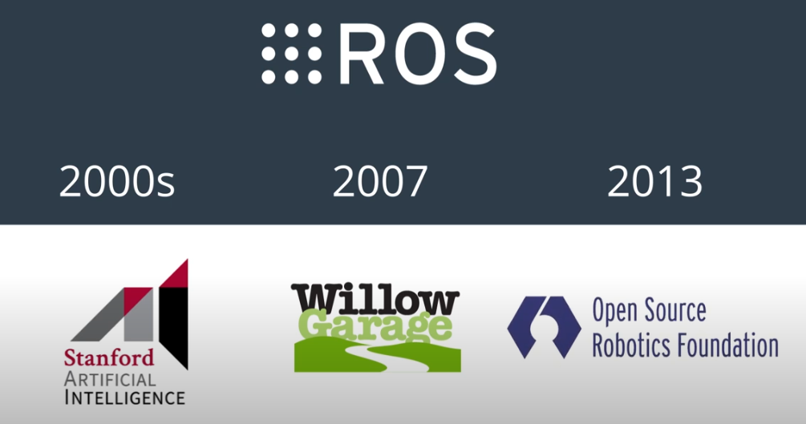
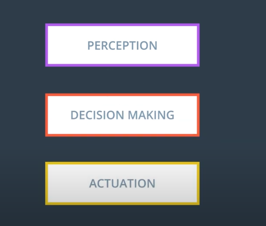
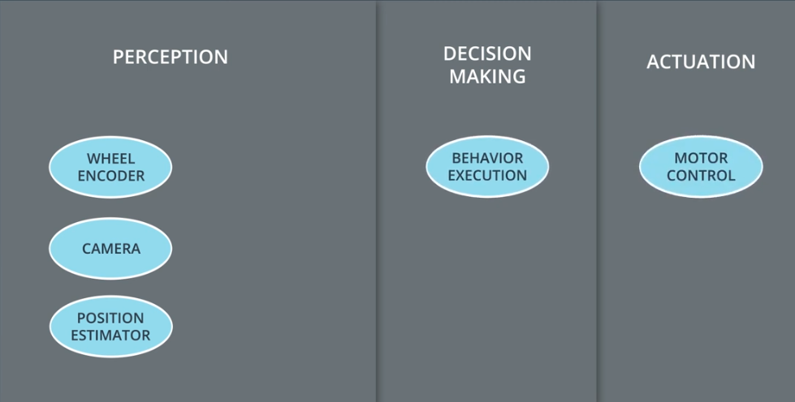
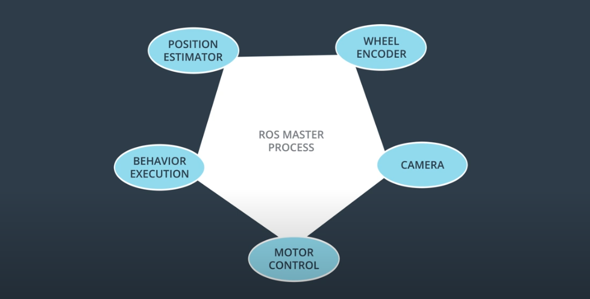
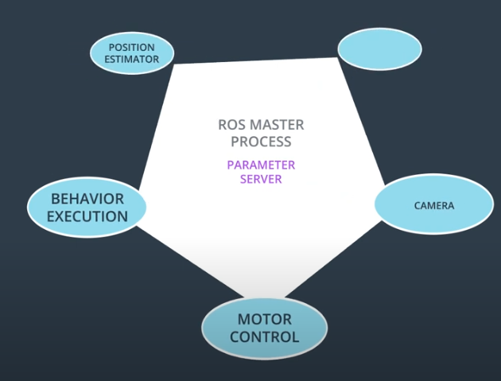
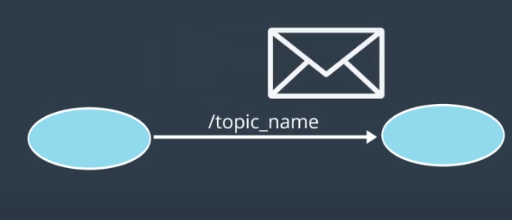
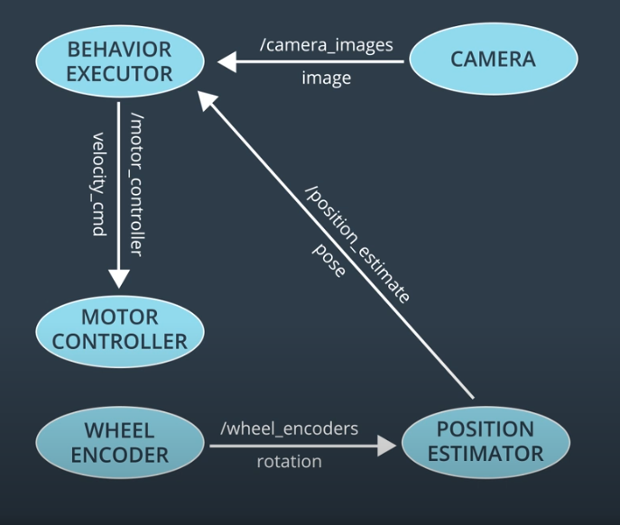
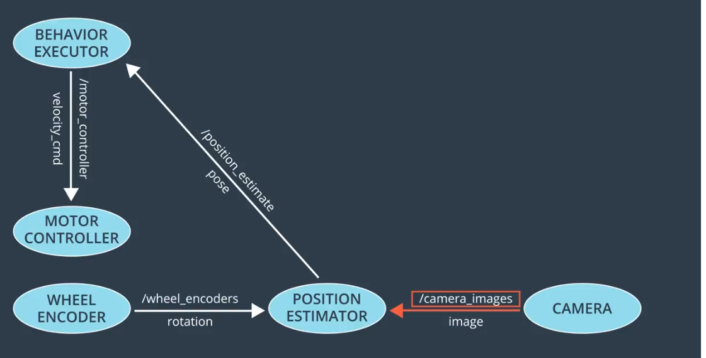

# ROS

Robot Operating System, or “ROS”, is a software framework that greatly simplifies robot development. There are many advantages to developing robots with ROS. Let’s start by illustrating some of its components and features.

## Components and Features
ROS is an open-source software framework for robotics development. It is not an operating system in the typical sense. But like an OS, it provides a means of communicating with hardware. It also provides a way for different processes to communicate with one another via message passing. Lastly, ROS features a slick build and package management system called catkin, allowing you to develop and deploy software with ease. ROS also has tools for visualization, simulation, and analysis, as well as extensive community support and interfaces to numerous powerful software libraries.

## Summary
Summary of ROS components and features:

- Open-source!
- Hardware abstraction of device drivers
- Communication via message passing
- Slick build and package management
- Tools for visualization, simulation, analysis
- Powerful software libraries

# Brief History of ROS
* 2000s
* 2007
* 2013

It was difficult to share code and ideas, and compare results.

# Nodes and Topics

Most robots share the same basic characteristics
* Contain Sensors for perception
* Software for making high level decisions decision making
* Motors and controllers for actuation

## Nodes
 ROS allows to this different components to communicate. ROS breaks down these complex steps (Perception, decision making and actuation) in to small units procesess called nodes.
 
 Typically, each node on a system, is responsable for one small and specific portion of the robots overall functionallity.

 

## ROS master
 At the center of this collection of nodes is the ros master, that acts as a manager of all the nodes. The ROS master maintain the registry of all the active nodes on a system. Each node can use this registry to discover other nodes and establish lines of communication.

In addition to allowing nodes to locate one another and communicate, the ROS master also host what's called the **parameter server**. As it's name suggest, the parameter server is typically used to store parameters and configuration values, that are shared among the running nodes.

* For example: A mobile robot sweet radius, may be used by one node to estimate position and by a different node to calculate speed. 

Rather than storing the same information in multiple places, nodes can look up the value as needed. Nodes can also share data, with one another by passing messages over what are called **topics**.

## Topics
You can think of a topic as a pipe between nodes, through which messages flow. In order to send a message on a topic, wa say that node must publish to that topic. Likewise, to receive a message on a topic, a node must subscribe to that topic.

## Example of topics, publishers and subcribers for the nodes

# Message Passing
Each ROS distribution comes with a variety of predefined messages. Over 200 different messages types. Messages can contain any kind of data.
In addition to the default message types, you can define your own custom messages.

## Physical quanitties
* Positions
* Velocities
* Accelerations
* Rotations
* Durations

## Sensor readings
* Laser scans
* Images
* Point Clouds
* Inertial Measurements

